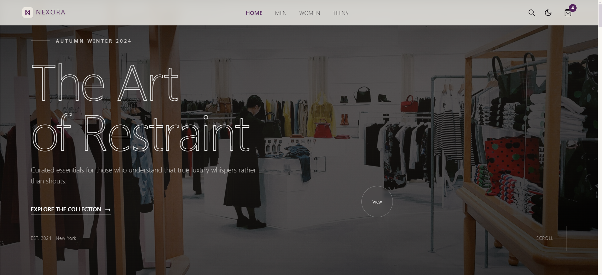
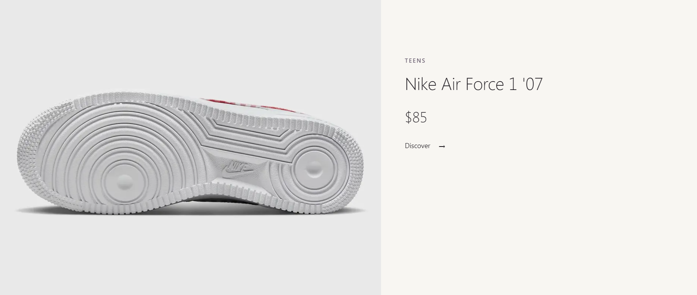
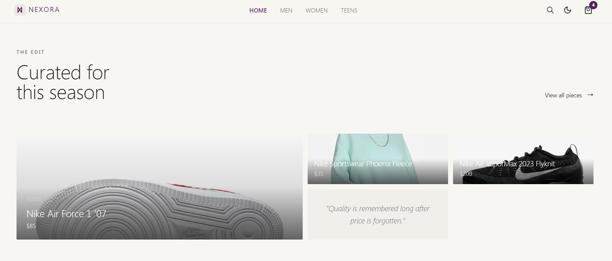
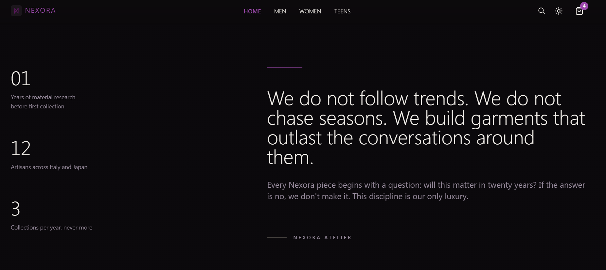
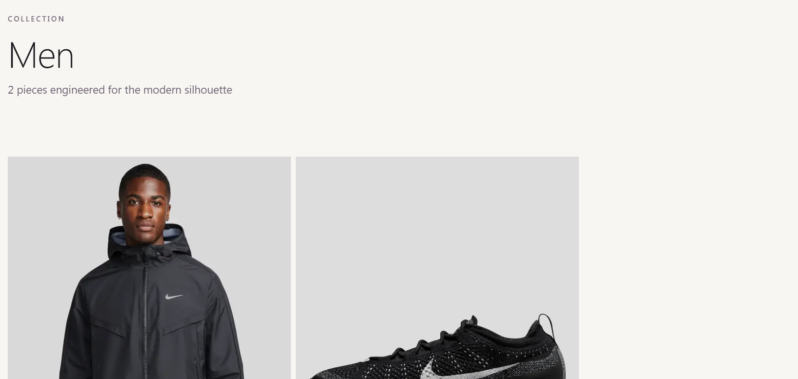
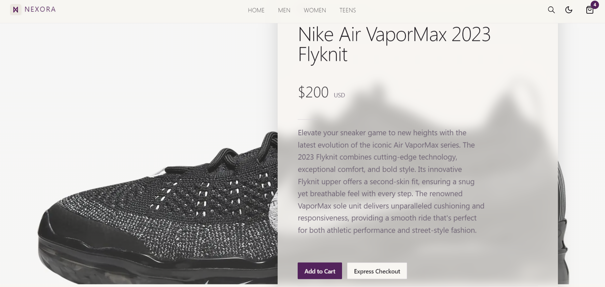
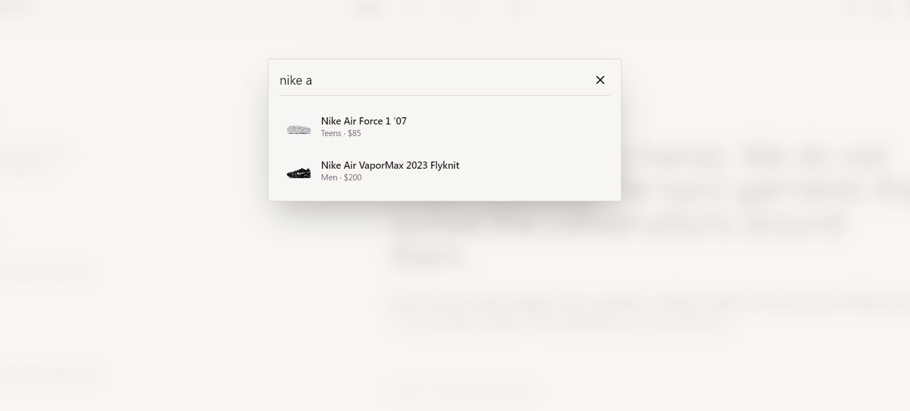
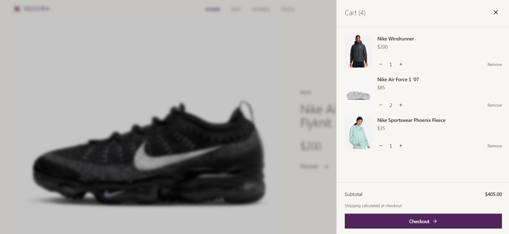
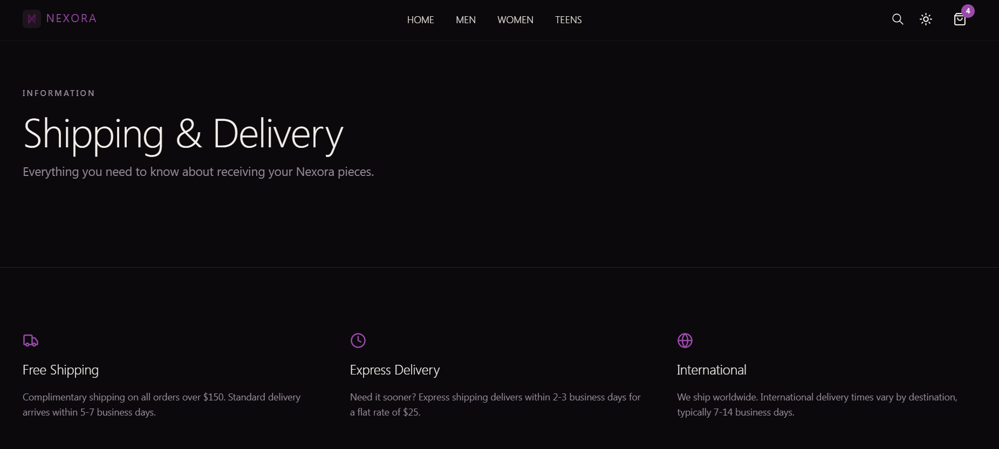
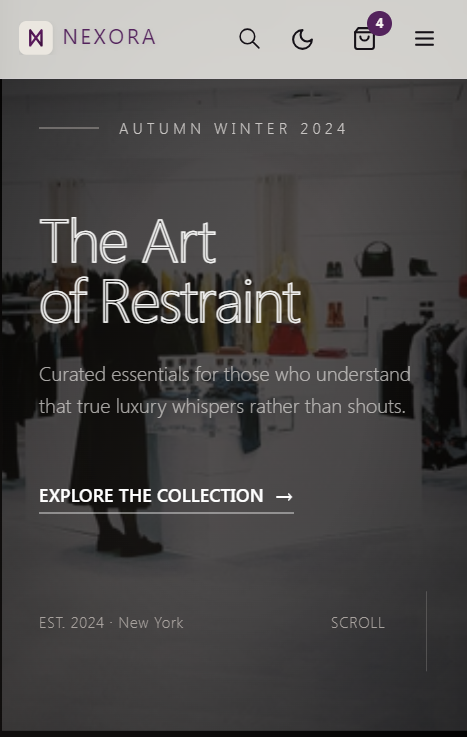

# Nexora

<div align="center">


**Curated essentials for modern living. Every piece selected with intention, crafted with integrity.**

[](https://nextjs.org/)
[](https://www.typescriptlang.org/)
[](https://tailwindcss.com/)
[](https://stripe.com/)
[](https://www.sanity.io/)

</div>

---

## 🎯 Problem

Most ecommerce platforms feel transactional. They dump products into grids, bombard users with carousels, and treat browsing as a chore rather than an experience. Fashion ecommerce has become a sea of identical Shopify templates — centered hero sections, "New Arrivals" spam, gradient buttons everywhere, and zero emotional resonance.

Luxury brands deserve digital spaces that communicate quality through **composition, restraint, and intentionality** — not through gimmicks. When every storefront looks the same, premium products feel cheap.

Designers and frontend engineers building portfolio-worthy ecommerce projects have two options: generic templates that look AI-generated, or building from scratch with no architectural guidance. Neither produces work that stands out.

---

## ✨ Solution

Nexora is a **cinematic ecommerce platform** where browsing feels deliberate, immersive, and emotionally engineered. Products are treated as protagonists in a visual narrative — not items to be dumped into card farms.

The experience blends **Swiss design discipline** with **editorial storytelling** and **brutalist clarity**. Every page is authored, not templated. Typography, spacing, motion, and photography work together to create desire through composition rather than decoration.

Built as a portfolio-defining reference for developers who refuse to ship generic work. This isn't a store — it's a statement about what ecommerce can feel like when treated as a craft.

---

## 🚀 Features

- **🎬 Cinematic Hero** — Full-screen parallax hero with mouse-responsive movement, custom cursor effects, and scroll-driven scale animations that set the tone immediately
- **📖 Editorial Product Narrative** — Asymmetric alternating layouts transform product browsing into a curated gallery experience with scroll-triggered reveals
- **🗿 Immersive Manifesto** — Dark split-section with animated statistics, bold typography, and parallax background imagery that maintains emotional intensity
- **🎨 Bento Grid Curation** — Asymmetric grid system with varying image scales, text blocks, and hover states that feel editorial rather than algorithmic
- **🧵 Material Story Section** — Clip-reveal animation that unveils full-width imagery with floating text, telling the story behind the garments
- **🌓 Dual Theme System** — Light and dark modes designed as "different lighting conditions of the same space," not two separate designs
- **🔍 Real-Time Search** — Debounced search with loading states, error handling, empty states, keyboard shortcuts (⌘K), and graceful degradation when offline
- **🛒 Frictionless Cart** — Spring-animated slide-out panel with item quantity controls, smooth removals, and Stripe checkout integration
- **💳 Stripe Checkout** — Production-ready payment flow with success/error handling and loading states
- **🏷️ Category Exhibitions** — Dynamic asymmetric product grids with varying spans that break free from repetitive card layouts
- **📱 Full Responsive** — Every section adapts from mobile to desktop with intentional layout shifts, not just stacking
- **♿ Accessibility First** — Semantic HTML, keyboard navigation, ARIA labels, focus indicators, and WCAG AA+ compliance throughout
- **⚡ Performance Engineered** — Static generation for product pages, ISR for categories, optimized images, minimal client JavaScript, and spring-based animations at 60fps
- **🎭 Custom Scrollbar** — Styled scrollbar that matches the design language instead of default browser chrome
- **🖼️ SSG + ISR Strategy** — Product pages pre-rendered at build time, categories revalidated hourly, all with proper metadata for SEO

---

## 🛠️ Tech Stack

| Technology                  | Why                                                                                             |
| --------------------------- | ----------------------------------------------------------------------------------------------- |
| **Next.js 14 (App Router)** | Server components, streaming, file-based routing, and hybrid rendering strategies (SSG + ISR)   |
| **TypeScript**              | Type safety across the entire codebase — product interfaces, API responses, and component props |
| **Tailwind CSS**            | Utility-first styling with custom design tokens for the aubergine/parchment palette             |
| **shadcn/ui**               | Accessible component primitives customized beyond recognition to avoid default aesthetics       |
| **Sanity CMS**              | Headless CMS for products, categories, and hero content with real-time previews                 |
| **use-shopping-cart**       | Cart state management with Stripe integration, persistent carts, and checkout redirects         |
| **Stripe**                  | Payment processing with hosted checkout, success/cancel URLs, and price IDs from Sanity         |
| **Framer Motion**           | Spring physics animations, scroll-driven transforms, parallax effects, and layout animations    |
| **Lucide Icons**            | Consistent iconography with tree-shakeable imports                                              |
| **Sonner**                  | Toast notifications for cart actions and checkout states                                        |

---

## 🏗️ Architecture Overview

```text
nexora/
├── app/                          # Next.js 14 App Router
│   ├── page.tsx                  # Homepage → ISR (60s revalidation)
│   ├── layout.tsx                # Root layout with providers
│   ├── category/
│   │   └── [category]/
│   │       └── page.tsx          # Category pages → ISR (hourly)
│   ├── product/
│   │   └── [slug]/
│   │       └── page.tsx          # Product pages → SSG (build time)
│   ├── about/
│   │   └── page.tsx              # About page → Static
│   ├── shipping/
│   │   └── page.tsx              # Shipping page → Static
│   ├── all/
│   │   └── page.tsx              # All products → ISR (hourly)
│   ├── stripe/
│   │   ├── success/
│   │   │   └── page.tsx          # Payment success
│   │   └── error/
│   │       └── page.tsx          # Payment failure
│   ├── api/
│   │   └── search/
│   │       └── route.ts          # Search API → Edge runtime
│   ├── error.tsx                 # Global error boundary
│   ├── not-found.tsx             # 404 page
│   └── loading.tsx               # Global loading state
│
├── components/
│   ├── cinematic/                # Motion system primitives
│   │   └── MotionPrimitives.tsx  # CinematicReveal, ParallaxSection, ScaleOnScroll
│   ├── home/                     # Homepage sections
│   │   ├── Hero.tsx              # Parallax hero with cursor effects
│   │   ├── ProductsNarrative.tsx # Editorial product layout
│   │   ├── Manifesto.tsx         # Immersive brand statement
│   │   ├── CuratedBento.tsx      # Asymmetric bento grid
│   │   ├── MaterialStory.tsx     # Clip-reveal section
│   │   └── Newsletter.tsx        # Dark newsletter section
│   ├── Navbar.tsx                # Navigation with search trigger
│   ├── Footer.tsx                # Multi-column footer
│   ├── SearchModal.tsx           # Search with debounce + error states
│   ├── ShoppingCartModal.tsx     # Animated cart panel
│   ├── ProductCard.tsx           # Product card with hover states
│   ├── AddToBag.tsx              # Cart add interaction
│   ├── CheckoutNow.tsx           # Direct checkout flow
│   ├── Providers.tsx             # Cart provider wrapper
│   ├── ThemeProvider.tsx         # Dark/light theme provider
│   └── ThemeToggle.tsx           # Theme switcher
│
├── lib/
│   ├── sanity.ts                 # Sanity client + image URL builder
│   ├── stripe.ts                 # Stripe configuration
│   ├── utils.ts                  # Shared utilities
│   └── interface.ts              # TypeScript interfaces
│
├── public/
│   ├── logo-full.svg             # Full brand logo
│   ├── favicon.svg               # Favicon
│   └── images/                   # Static imagery
│
└── styles/
    └── globals.css               # Design tokens + custom scrollbar
```

### Data Flow

```text
Sanity CMS → fetch() at build/request time → Server Components → Client Components
                                                      ↓
                                              Static Generation (SSG)
                                              Incremental Static Regeneration (ISR)
                                                      ↓
                                              Stripe Checkout (Client-side)
```

### Rendering Strategy

| Page Type      | Strategy                              | Revalidation   | Why                                                     |
| -------------- | ------------------------------------- | -------------- | ------------------------------------------------------- |
| Product pages  | **SSG** with `generateStaticParams()` | On rebuild     | Products change rarely, need instant load, SEO-critical |
| Category pages | **ISR**                               | 3600s (1 hour) | Products may be added/removed, but not constantly       |
| All products   | **ISR**                               | 3600s (1 hour) | Same as categories — freshness without rebuilds         |
| Homepage       | **ISR**                               | 60s            | Featured products may rotate, hero content updates      |
| Static pages   | **Static**                            | On rebuild     | About, shipping — rarely change                         |

---

## 📸 Screenshots

### 🏠 Homepage — Hero Section



---

### 🏠 Homepage — Product Narrative



---

### 🏠 Homepage — Curated Bento Grid



---

### 🌙 Homepage — Manifesto (Dark Section)



---

### 🛍️ Category Page



---

### 👕 Product Page



---

### 🔍 Search Modal



---

### 🛒 Cart Panel



---

### 🌓 Dark Mode



---

### 📱 Mobile Responsive



---

## 🔗 Live Link

[Live Demo](https://nexora-vert.vercel.app/)

---

## 📦 Setup Instructions

### Prerequisites

- Node.js 18+
- npm or yarn
- A [Sanity](https://www.sanity.io/) account (free tier works)
- A [Stripe](https://stripe.com/) account (test mode is fine)

### 1. Clone the Repository

```bash
git clone https://github.com/your-username/nexora.git
cd nexora
```

### 2. Install Dependencies

```bash
npm install
```

### 3. Environment Variables

Create a `.env.local` file in the root:

```env
# Sanity
NEXT_PUBLIC_SANITY_PROJECT_ID=your_project_id
NEXT_PUBLIC_SANITY_DATASET=production
SANITY_API_TOKEN=your_api_token

# Stripe
NEXT_PUBLIC_STRIPE_KEY=pk_test_your_publishable_key
STRIPE_SECRET_KEY=sk_test_your_secret_key
```

### 4. Set Up Sanity CMS

#### Option A: Use an existing Sanity project

- Create a Sanity project at [sanity.io/manage](https://www.sanity.io/manage)
- Deploy the schemas from `/sanity/schemas/`
- Add your project ID to `.env.local`

#### Option B: Use the provided schemas

The project includes Sanity schemas for:

- `product` — name, images, description, slug, price, Stripe price ID, category reference
- `category` — category name
- `heroImage` — two hero images

Add products through the Sanity Studio to populate the store.

### 5. Set Up Stripe

1. Create products and prices in your [Stripe Dashboard](https://dashboard.stripe.com/)
2. Copy the Price IDs into your Sanity product documents as `price_id`
3. Add your Stripe keys to `.env.local`

### 6. Run the Development Server

```bash
npm run dev
```

Open http://localhost:3000 in your browser.

### 7. Build for Production

```bash
npm run build
npm start
```

The build will pre-render all product pages at build time (SSG) and set up ISR for categories and the homepage.

---

## 🎨 Design Philosophy

Nexora rejects generic ecommerce patterns. You won't find:

- ❌ Centered hero sections with CTA buttons
- ❌ Shopify-style product card farms
- ❌ Rotating carousels
- ❌ Feature grids with icons
- ❌ Glassmorphism or glow effects
- ❌ Default Tailwind aesthetics
- ❌ Floating blobs for decoration
- ❌ Predictable section sequencing
- ❌ "New Arrivals" spam
- ❌ Excessive badges, chips, or pills

Instead, every section is **authored** — composed with the discipline of editorial design and the precision of a frontend engineer who refuses to ship generic work.

The aubergine and parchment palette was chosen to stand apart from the sea of blue, purple, green, and earth-tone ecommerce. It's warm, editorial, and memorable.

---

## 🤝 Contributing

This is a portfolio project, but feedback and suggestions are welcome. Open an issue or submit a pull request if you spot something worth improving.

---

## 📄 License

MIT — use this as a reference, inspiration, or starting point for your own work. Just don't claim it as your own portfolio piece verbatim.

---

## 🙏 Acknowledgments

> First and foremost, all praise is due to **Allah**, the Most Merciful, who has granted me the knowledge and ability to complete this project.

Special thanks to:

- [Jan Marshal](https://janmarshal.com/about) for the inspiration and foundational work this project builds upon
- The **Next.js** team for their incredible framework
- **Sanity.io** for their flexible headless CMS
- **Stripe** for their developer-friendly payment solutions
- The open-source community for countless packages and tools

---

<div align="center">

**Built with intention ❤️. Designed for longevity.**

</div>
